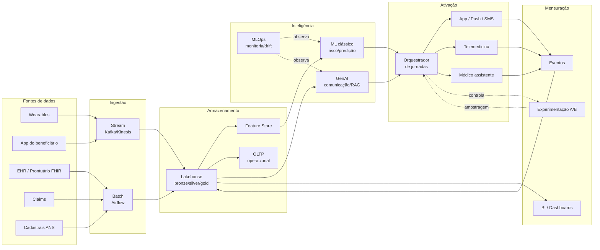
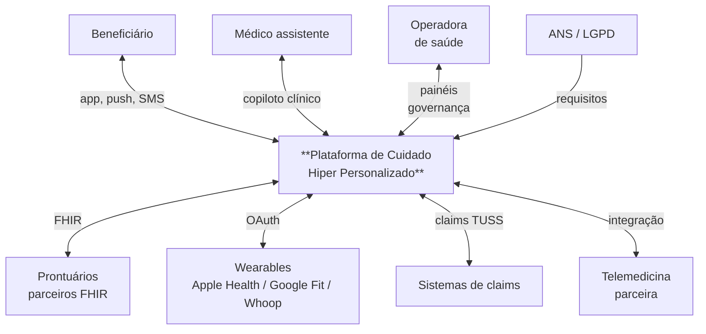

# 02 — Arquitetura Ponta a Ponta

## Visão geral

A arquitetura é desenhada em **camadas independentes** que se comunicam por contratos de eventos e APIs. Cada camada pode evoluir, escalar e ser substituída sem quebrar as demais.

## C4 nível 1 — Contexto

## C4 nível 2 — Contêineres

| Contêiner | Responsabilidade | Stack sugerida |
|---|---|---|
| **API Gateway** | Autenticação, throttling, observabilidade | Kong / AWS API Gateway |
| **App backend** | Jornada do beneficiário, consentimento, eventos | Python (FastAPI) |
| **Ingestion stream** | Sinais contínuos (wearable, eventos do app) | Kafka / Kinesis + schema registry |
| **Ingestion batch** | Claims, EHR, cadastrais | Airflow + Spark |
| **Lakehouse** | Bronze (raw) → Silver (curado) → Gold (analítico) | S3 + Iceberg / Delta |
| **Feature Store** | Features online (low-latency) e offline (treino) | Feast |
| **Model registry** | Versionamento de modelos, lineage | MLflow |
| **ML serving** | Inferência online (risco, propensão) | BentoML / SageMaker / Vertex |
| **GenAI gateway** | Roteamento, caching, redação de PII, guardrails | LiteLLM + camada própria |
| **Orquestrador de jornadas** | Regras + decisões → ações por canal | Temporal / Argo Workflows |
| **OLTP operacional** | Estado da jornada, consentimento, contatos | PostgreSQL |
| **Observabilidade** | Logs, métricas, traces, model monitoring | OpenTelemetry + Grafana + Evidently |
| **Data warehouse de BI** | Painéis executivos | BigQuery / Redshift / Snowflake |

## Camadas em detalhe

### 1. Coleta

| Fonte | Frequência | Volume estimado | Latência alvo |
|---|---|---|---|
| Wearable (HR, HRV, passos, sono) | Streaming (1-5 min) | ~50 eventos/dia/usuário | < 1 min |
| App (eventos de uso, PROMs) | Sob demanda | Variável | < 5 s |
| EHR (consultas, exames, diagnósticos) | Batch noturno | ~2-5 registros/mês/usuário | D+1 |
| Claims (autorizações, custos) | Batch noturno | ~1-3 registros/mês/usuário | D+1 |
| Cadastrais | Diário | Baixo | D+1 |

**Padronização:** sempre que possível, dados clínicos em **HL7 FHIR R4** (Patient, Observation, Condition, MedicationRequest). Wearables convertidos para `Observation` com `code` LOINC. Cláim em **TUSS** mapeado para FHIR `ChargeItem`.

**Consentimento:** evento de consentimento explícito por finalidade — exigência LGPD ([`docs/04`](04-dados-e-conformidade.md)). Sem consentimento ativo para uma finalidade, o dado não entra no pipeline daquela finalidade.

### 2. Ingestão

- **Streaming** para sinais contínuos (wearable, eventos do app). Pipeline `event → Kafka → schema registry → bronze`. Schema validado, eventos malformados vão para DLQ.
- **Batch** para origens transacionais (EHR, claims). Airflow orquestra extrações idempotentes. Cada DAG tem teste de qualidade (`great_expectations`) antes de promover de bronze para silver.

**Idempotência** é regra: toda escrita usa chave natural + versão, dedup é responsabilidade do consumidor.

### 3. Armazenamento

**Padrão Lakehouse com 3 camadas:**

- **Bronze** — raw, append-only, retém payload original e metadados de ingestão. Útil para reprocessamento.
- **Silver** — limpo, deduplicado, com `patient_id` resolvido (MDM). Aqui que o FHIR fica canônico.
- **Gold** — agregado por caso de uso: features de modelo, KPIs de painel, datasets analíticos.

**Particionamento** por data + tenant (operadora) + perfil. **Catálogo** unificado (Glue/Unity Catalog) com lineage e classificação de sensibilidade (PII / PHI / agregado).

**OLTP separado** para o que precisa de consistência forte e baixa latência: estado da jornada, consentimento, fila de ações pendentes.

### 4. Inteligência

Detalhe completo em [`docs/05-estrategia-ia.md`](05-estrategia-ia.md). Resumo:

- **Modelos discriminativos (ML clássico)** para decisão clínica e financeira: risco, agudização, sinistralidade, propensão a engajamento. Servidos online via feature store.
- **GenAI** para texto: copiloto clínico, geração de mensagens personalizadas, RAG sobre protocolos. Sempre com guardrail e observabilidade de prompts/respostas.
- **MLOps** com monitoramento de drift, viés por subgrupo (idade, sexo, região), e gate de promoção exigindo métrica clínica + métrica de fairness.

### 5. Ativação

O **orquestrador de jornadas** é o cérebro. Ele recebe sinais de risco/oportunidade e decide:
- Qual ação (consulta, exame, conteúdo, alerta)
- Qual canal (push, SMS, WhatsApp, ligação ativa, telemedicina)
- Qual horário (modelo de propensão por janela)
- Quando escalar para humano

A regra é declarativa, versionada, e cada execução gera evento auditável (input, decisão, ação tomada).

### 6. Mensuração

Toda ação dispara um **evento de telemetria** com `journey_id`, `decision_id`, `action`, `channel`, `outcome`. Esses eventos voltam para o lakehouse e alimentam:
- Painéis executivos (sinistralidade, custo, eventos prevenidos)
- Painéis clínicos (PQI, agudização, adesão)
- Plataforma de experimentação (A/B test e quase-experimento)

Ver [`docs/06-mensuracao.md`](06-mensuracao.md).

## Decisões arquiteturais-chave

Detalhadas em [`docs/adr/`](adr/). Resumo:

| ADR | Decisão | Por quê |
|---|---|---|
| 001 | Lakehouse > Data warehouse puro | PHI semi-estruturado + ML em escala |
| 002 | FHIR R4 como modelo canônico | Interoperabilidade + vocabulário regulado |
| 003 | ML clássico para decisão clínica | Auditabilidade, custo, regulação |
| 004 | LLM apenas em camadas de texto | Reduzir risco de alucinação clínica |
| 005 | Feature Store dedicada | Reduzir skew treino-inferência |
| 006 | Orquestração via Temporal | Idempotência + visibilidade de jornadas longas |

## Escalabilidade para 4,6M de beneficiários

- **Inferência online de risco:** ~1 req/s sustentada com picos manhã/noite. Stack horizontal (k8s + HPA), latência p99 < 200 ms.
- **Streaming de wearables:** ~2.700 eventos/s sustentados (50 ev/dia × 4,6M / 86400). Kafka particionado por `patient_id`, retenção 7 dias em quente, depois lake.
- **Batch noturno:** janela de 4h para processar EHR + claims do dia. Spark com auto-scaling.
- **GenAI:** chamadas roteadas por modelo (haiku para tarefas simples, sonnet/opus para clínico), com cache semântico para reduzir custo. Orçamento mensal monitorado por unidade de negócio.

## Resiliência

- **Falha de fonte externa** (wearable API down) → degradação graciosa, jornada continua com dados anteriores e alerta operacional.
- **Falha do ML serving** → orquestrador usa última decisão válida + escala para humano em casos vermelhos.
- **Falha do GenAI** → fallback para template determinístico por persona/risco. Beneficiário recebe mensagem mais genérica, mas recebe.
- **Multi-AZ** mínimo, multi-região como roadmap (LGPD permite, mas exige diligência sobre sub-processadores).

## O que está no protótipo vs o que está só no diagrama

| Componente | No protótipo? | Justificativa |
|---|---|---|
| API + ML + GenAI + orquestração simples | ✅ | É a fatia vertical que prova a tese |
| Dados sintéticos | ✅ | Sem PHI real, ágil |
| FastAPI + XGBoost + OpenRouter (OpenAI-compatible) | ✅ | Stack simples, demonstrável; provider-neutral via env var |
| Kafka, Airflow, Spark, Feature Store | ❌ | Documentados em [`infra/architecture-target.md`](../infra/architecture-target.md) |
| FHIR completo | ❌ | Schema simplificado no protótipo, FHIR é alvo de produção |
| Multi-tenant, multi-região | ❌ | Roadmap |

A fatia vertical do protótipo foi escolhida para **exercitar todos os 5 aspectos do case** (coleta, tratamento, armazenamento, mensuração, personalização) com o menor número de componentes possível, sem disfarçar o que de fato seria infraestrutura de produção.
