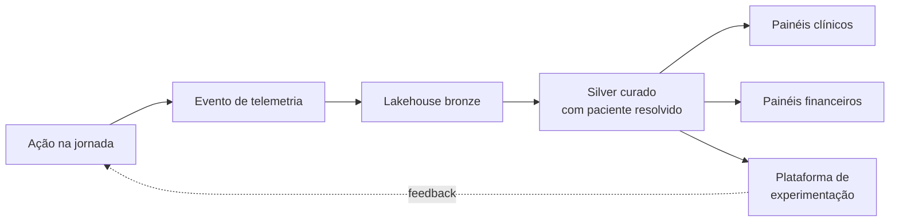

# 06 — Mensuração de Efetividade e Engajamento

> **Premissa:** uma plataforma de saúde digital que não mede impacto clínico não é cuidado, é UX. Mensuração não é dashboard — é o **ciclo fechado** que valida cada hipótese de intervenção contra dados reais.

## As três dimensões (recapitulando)

Toda intervenção é avaliada simultaneamente em:

1. **Saúde do beneficiário** — desfecho clínico real, não proxy
2. **Sinistralidade e operação** — impacto financeiro mensurável
3. **Engajamento** — uso, adoção, retenção do produto

**Regra:** ganhar em uma dimensão e perder em outra invalida a hipótese. Reduzir sinistralidade cortando consulta piora desfecho. Aumentar engajamento empurrando spam destrói retenção. As três sobem juntas ou voltamos pra prancheta.

---

## 1. KPIs clínicos

### Estratificação por trilha
Métricas medidas **por coorte** (jovem, crônico, idoso) e por trilha de cuidado.

| Métrica | O que mede | Cadência |
|---|---|---|
| **PQI — Prevention Quality Indicators** | Taxa de internações por condições sensíveis a cuidado ambulatorial (AHRQ) | Trimestral |
| **Taxa de agudização em crônicos** | % de hipertensos descompensados, % de diabéticos com HbA1c > 7 | Mensal |
| **Adesão terapêutica** | Razão dispensação/prescrição por classe de medicação | Mensal |
| **Cobertura preventiva** | % com check-up anual, vacinação em dia, exames de rastreio na idade | Trimestral |
| **PROMs — Patient-Reported Outcome Measures** | Instrumentos validados (PHQ-9 saúde mental, escalas funcionais) | Trimestral |
| **PREMs — Patient-Reported Experience Measures** | Qualidade percebida do cuidado | Trimestral |
| **Eventos adversos** | Reações, eventos não previstos, escalonamentos para hospital | Contínuo |
| **Taxa de queda em idosos** | Quedas/100 pacientes-mês | Mensal |
| **Internações evitadas (estimadas)** | Pacientes em alto risco que não internaram após intervenção | Trimestral |

### Por que essas e não outras
- **PQI** é padrão internacional (AHRQ) — comparável e auditável.
- **PROMs/PREMs** capturam qualidade de vida e experiência, que NPS sozinho não captura.
- **Adesão** mede comportamento, não intenção — fonte é dispensação real, não autorrelato.

---

## 2. KPIs financeiros

### Métricas-âncora

| Métrica | Fórmula | Meta de referência |
|---|---|---|
| **Sinistralidade** | (custo médico / receita) × 100 | Redução de 1-3 p.p. em 12 meses |
| **Custo médico per capita por coorte** | total claim / vidas-mês | Redução em coorte de risco controlado |
| **CAEP — Custo de Aquisição de Evento Prevenido** | (investimento no programa) / (eventos evitados) | < custo médio do evento |
| **ROI do programa** | (custo evitado − investimento) / investimento | > 1.0 em 12 meses |
| **% de crônicos controlados** | controlados / total de crônicos | Crescente |
| **Custo médio por internação evitada** | benchmark de internação na coorte | Comparado com investimento no programa |

### Granularidade
- **Por coorte** (jovem, crônico, idoso, demais)
- **Por região** (nacional vs cluster geográfico)
- **Por intervenção** (mensagem preventiva, telemed proativa, visita domiciliar, etc.)

### Cuidado com a métrica errada
- **Sinistralidade isolada engana** — corta consulta hoje, paga UTI amanhã. Sempre cruzar com PQI e desfecho clínico.
- **CAEP em janela curta engana** — programa preventivo tem retorno em 12-24 meses. Painel deve mostrar curva, não snapshot.
- **Atribuição** é difícil — quem evitou a internação foi a mensagem do app ou foi a visita do enfermeiro? Por isso experimentação controlada (próxima seção).

---

## 3. KPIs de engajamento (produto)

| Métrica | O que mede |
|---|---|
| **Taxa de ativação** | % de beneficiários com pelo menos um sinal contínuo conectado (app, wearable) |
| **D1/D7/D30 retention** | Retenção no app por janela |
| **Taxa de resposta a recomendação** | % que executou a ação sugerida no SLA |
| **Tempo médio até primeira ação preventiva** | Da ativação até primeira conversão |
| **Cobertura de canal por persona** | % de Júlias engajadas via push, % de Joãos engajadas via voz |
| **NPS específico por trilha** | NPS segmentado |
| **Churn de engajamento** | % que era ativo e ficou inativo > 30 dias |

### Nuance importante
Engajamento não é **uso de feature**. É **comportamento que muda saúde**. Beneficiário pode usar pouco o app e ter comportamento muito saudável — não vamos otimizar telas em pé de desfecho clínico.

---

## 4. Estratégia de experimentação

### Por que A/B simples não basta sempre
Em saúde, **randomização individual em intervenção clínica nem sempre é ético** ("você não recebe lembrete de medicação porque é grupo de controle" pode ferir cuidado básico). Por isso a plataforma usa um portfólio de métodos:

| Método | Quando usar | Exemplo |
|---|---|---|
| **A/B test (RCT digital)** | Variações de UX, tom de mensagem, canal | Mensagem A vs B para Júlia |
| **A/B test estratificado** | Variações de feature em coortes não-críticas | Conteúdo preventivo de jovens |
| **Quase-experimento (DiD)** | Comparar antes/depois entre região com programa e sem | Adoção gradual por região |
| **Coorte sintética / matching (PSM)** | Comparar pacientes com programa vs match não exposto | Avaliar trilha de crônico |
| **Escalonamento progressivo** | Roll-out gradual com gate em métricas clínicas | Toda nova trilha entra assim |
| **N-of-1 com paciente** | Personalização granular de hábito (rara) | Otimização de horário de medicação |

### Plataforma de experimentação
- **Atribuição estável** por `patient_id` com hash determinístico
- **Pré-registro** da hipótese, métrica primária e MDE (Minimum Detectable Effect) antes de iniciar
- **Análise sequencial** com correção (alpha-spending) para evitar peeking
- **Holdout permanente** de 1-2% para medição de efeito agregado de longo prazo
- **Aprovação ética** para qualquer experimento que toque desfecho clínico (revisão por comitê)

### Métrica primária × secundárias × guardrail
Cada experimento define:
- **Primária** — a hipótese que está sendo testada (ex.: "esta mensagem aumenta adesão em 5 p.p.")
- **Secundárias** — efeitos esperados ou de interesse (ex.: NPS, retenção)
- **Guardrails** — métricas que **não podem piorar** mesmo se a primária ganhar (ex.: eventos adversos, abandono, custo)

Ganho na primária com piora em guardrail → não promove.

---

## 5. Pipeline de mensuração

- **Toda decisão e toda ação** geram evento com `journey_id`, `decision_id`, `model_version`, `action`, `channel`, `outcome`.
- **Eventos clínicos** (consulta realizada, internação, exame, alta) entram via integração com EHR/claims.
- **Painéis** consultam silver com camada semântica (dbt) — métricas têm definição única e versionada.

## 6. Painéis (consumidores das métricas)

### Painel executivo (operadora)
- Sinistralidade por mês × meta
- ROI do programa × invested
- Cobertura por trilha
- Eventos prevenidos estimados

### Painel clínico
- Pacientes em alto risco com plano de ação ativo
- PQI por coorte
- Adesão e cobertura preventiva
- Alertas de qualidade de cuidado

### Painel de produto
- Ativação, retenção, NPS por trilha
- Funil de jornada
- Performance de canal e horário
- Resultados de experimentos ativos

### Painel de governança e IA
- Drift de modelos
- Fairness por subgrupo
- Volume e custo de chamadas a LLM
- Incidentes e SLA

---

## 7. Como o avaliador vê isso

A entrega atende explicitamente o aspecto **"Efetividade e engajamento"** do PDF original com:

1. **KPIs reais e auditáveis** (PQI, PROMs, CAEP), não inventados
2. **Três dimensões obrigatórias** (clínico, financeiro, engajamento) com regra de "não pode subir uma e descer outra"
3. **Estratégia de experimentação** que não é só A/B genérico — usa quase-experimento e PSM porque saúde tem restrições éticas a randomização
4. **Pipeline técnico** real, com semântica versionada, não "vamos puxar dado e olhar"
5. **Cuidado com métrica errada** explicitamente nomeado (sinistralidade isolada engana, CAEP em janela curta engana)

> **Mensurar bem é o que separa programa preventivo real de marketing de prevenção.**
