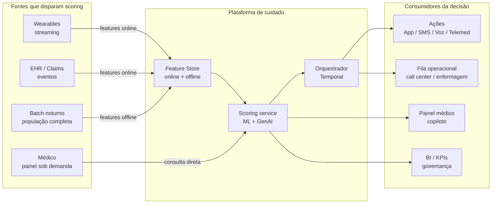
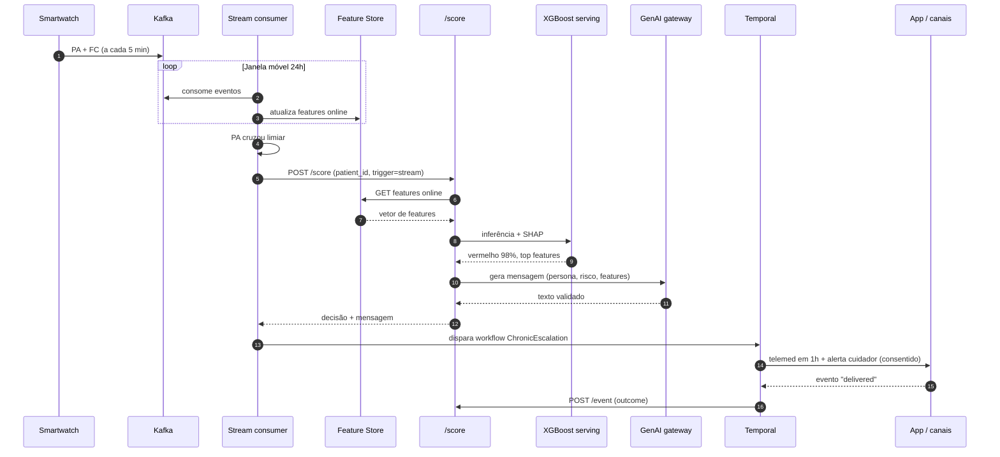

# 08. Integração em Produção: como o `/score` é consumido de verdade

> No protótipo o `/score` é chamado por `curl @samples/maria.json`. Em produção, ninguém manda `curl` em milhões de pacientes. Este documento descreve **quem chama**, **com que dados**, **com que frequência** e **o que faz com a resposta**.

## Visão geral



## Modos de invocação do `/score`

A plataforma é chamada em **quatro contextos** distintos. O endpoint é o mesmo, mas o **gatilho**, a **frequência** e o **consumidor da resposta** mudam.

### Modo 1. Streaming reativo (wearable)

| | |
|---|---|
| **Gatilho** | Beneficiário envia leitura do wearable (PA, FC, sono) |
| **Frequência** | A cada 1 a 5 min por usuário ativo (~2.700 ev/s sustentados em 4,6M) |
| **Caminho** | Wearable API → Kafka → stream consumer → janela móvel (24h a 7d) → cruza limiar → `/score` |
| **Latência alvo** | < 1 min do dado bruto até o output |
| **Consumidor** | Orquestrador Temporal. Se classe muda ou risco vermelho, dispara workflow |

**Exemplo:** Maria mede pressão duas vezes em uma hora e a média de 24h ultrapassa o limiar configurado para sua coorte → consumer chama `/score` → retorna vermelho → Temporal dispara `ChronicEscalationWorkflow` que aciona telemedicina.

### Modo 2. Batch noturno populacional

| | |
|---|---|
| **Gatilho** | Cron diário (ex.: 02:00 BRT) |
| **Frequência** | 1×/dia, toda a base ativa |
| **Caminho** | Spark job lê features do **gold** → chama scoring em lote (paralelizado) → escreve resultado em tabela `daily_risk_scores` + materializa ações sugeridas |
| **Latência alvo** | Janela de 4h pra processar 4,6M |
| **Consumidor** | BI, painel clínico, fila de ações do dia |

**Exemplo:** noite passa, scoring roda em todos os crônicos. Pela manhã, equipe de enfermagem vê 320 casos vermelho na fila ordenados por SLA, com mensagem já pré-aprovada pelo workflow.

### Modo 3. Trigger por evento clínico

| | |
|---|---|
| **Gatilho** | Eventos do EHR/Claims via webhook ou CDC: alta hospitalar, exame com alteração crítica, dispensação de medicação nova |
| **Frequência** | Centenas a milhares por dia |
| **Caminho** | Sistema parceiro → adapter FHIR → `/score` reativo |
| **Latência alvo** | < 5 min do evento até o output |
| **Consumidor** | Orquestrador (escalonamento imediato) + painel médico |

**Exemplo:** João tem alta hospitalar com diagnóstico de descompensação cardíaca → adapter recebe evento FHIR `Encounter.discharged` → `/score` retorna vermelho → workflow agenda telemed em 24h e visita domiciliar em 72h.

### Modo 4. Sob demanda (médico/atendente)

| | |
|---|---|
| **Gatilho** | Profissional de saúde abre prontuário no sistema |
| **Frequência** | Variável, picos diurnos |
| **Caminho** | Painel do médico → backend chama `/score` com `patient_id` → renderiza recomendação, top features e mensagem sugerida |
| **Latência alvo** | < 200 ms p99 |
| **Consumidor** | Médico. Aceita, edita ou rejeita; feedback alimenta avaliação contínua |

**Exemplo:** cardiologista abre paciente no painel → vê *"Risco vermelho. Pressão sistólica e adesão são os fatores mais relevantes nos últimos 30 dias"* → ajusta a sugestão → aprova envio.

## Fluxo de dados (não é payload. É feature)

No protótipo o cliente **manda** o payload via JSON. Em produção:

| | Protótipo | Produção |
|---|---|---|
| **De onde vêm as features** | Cliente monta o payload | Feature Store online (Redis) populada por stream + batch |
| **Quem chama o /score** | `curl` no terminal | Stream consumer, batch job, webhook adapter, painel |
| **Identificação** | Payload completo | Apenas `patient_id` + timestamp; serviço busca features no store |
| **Caching** | Ausente | Multi-camada: feature store + cache de inferência + cache semântico no GenAI |

A assinatura real do endpoint em produção fica mais como:

```
POST /score
{
  "patient_id": "BEN0000001",
  "as_of": "2026-04-29T13:30:00Z",
  "trigger": "stream|batch|event|on_demand",
  "context_version": "v3"
}
```

Features são buscadas no Feast online com `as_of` correto. Sem leakage temporal, sem skew treino-inferência.

## Sequência ponta a ponta. Jornada da Maria



## Quem consome a saída do `/score`

### Orquestrador de jornadas (Temporal)
- Workflow durável recebe decisão + ação sugerida
- Executa atividades idempotentes (push, SMS, agendamento, ligação ativa)
- Re-tenta com backoff em falha
- Continua de onde parou após deploy

### Painel do médico (copiloto clínico)
- Mostra risco + top features explicativas + mensagem sugerida
- Médico aprova / edita / rejeita
- Feedback é registrado e alimenta avaliação do prompt e modelo

### Fila operacional (call center / enfermagem)
- Casos vermelho com `requires_human=true` entram em fila priorizada por SLA
- Atendente vê paciente, motivo da escalação e ações já tomadas

### BI e governança
- Eventos `score_decision` agregados por coorte, região, modelo, drift, fairness
- Painéis clínico, executivo, de produto e de IA. Ver `docs/06-mensuracao.md`

## Quem invoca quem

| Origem | Frequência típica | Endpoint |
|---|---|---|
| Stream consumer (wearable) | Sob demanda quando feature cruza limiar | `POST /score` |
| Batch scoring nightly | 1×/dia, em massa | `POST /score` (paralelizado) |
| Webhook EHR / CDC Claims | Eventos clínicos relevantes | `POST /score` |
| Painel do médico | Quando médico abre paciente | `POST /score` |
| App do beneficiário | Quando beneficiário interage | `POST /event` |
| Workflow Temporal (idempotente) | Após cada activity | `POST /event` |

## Performance esperada em produção

| Métrica | Alvo |
|---|---|
| Latência `/score` p50 | < 80 ms |
| Latência `/score` p99 | < 200 ms |
| Throughput sustentado | 1.000 req/s (stream + on-demand) |
| Pico de batch | 10.000 req/s (paralelizado, fora do horário comercial) |
| Custo de inferência ML | centavos por mil predições |
| Custo de GenAI por mensagem | ~US$ 0,0004 em Haiku-class (com cache, ~30% menos) |
| Disponibilidade | 99,9% (SLO) |

## Resiliência por modo

| Cenário | Comportamento |
|---|---|
| Stream consumer cai | Kafka segura mensagens, consumer retoma do offset salvo |
| Feature store online indisponível | Fallback para gold offline (latência maior, mas não trava) |
| ML serving cai | Orquestrador usa última decisão válida + escala manualmente |
| GenAI provider cai | `genai/client.py` → fallback determinístico, mensagem mais genérica mas chega |
| Workflow falha | Temporal retoma idempotente após recovery |

## Diferenças vs protótipo (recapitulando)

| Aspecto | Protótipo | Produção |
|---|---|---|
| Quem chama `/score` | curl manual | stream, batch, evento, painel |
| De onde vêm as features | Payload completo no body | Feature Store via `patient_id` |
| Quem consome a saída | Terminal | Temporal, painel, fila, BI |
| Volume | Manual | 4,6M usuários × várias chamadas/dia |
| Cache | Ausente | Multi-camada |
| Modelo | Único, treinado uma vez | Versionado, retreinado, com gate de promoção |
| Auditoria | Logs locais | Lineage completo + RoPA + DPIA viva |

## O que isso muda para o entendimento da arquitetura

O protótipo demonstra a **fatia vertical de decisão**. A produção adiciona:

1. **Camada de coleta e materialização de features:** Sem ela, nenhum modo acima funciona em escala
2. **Orquestração durável:** Sem ela, jornadas longas de cuidado se perdem em deploy/falha
3. **Múltiplos modos de invocação:** Sem isso, ninguém usa o `/score` (ele só responde se for chamado)
4. **Observabilidade do ciclo completo:** Sem isso, não há mensuração nem governança

Cada um desses pontos tem ADR correspondente (ver `docs/adr/`) e é detalhado na arquitetura-alvo (`infra/architecture-target.md`).
