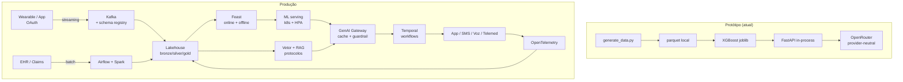

# Arquitetura-alvo de produção

> Este documento mostra **o que separa o protótipo da produção real**. O protótipo prova a tese; este documento explica o que cada camada vira quando opera para 4,6M de beneficiários sob restrições regulatórias e de SLA.

## Resumo do gap

| Camada | Protótipo | Produção |
|---|---|---|
| Coleta wearable | JSON sintético em arquivo | Streaming via Kafka + schema registry |
| Coleta EHR/claims | Parquet sintético gerado uma vez | Airflow + Spark com adapters FHIR e TUSS |
| Storage | Parquet local | Lakehouse (S3 + Iceberg/Delta), bronze→silver→gold |
| Feature engineering | Função Python compartilhada | Feast com online (Redis) e offline (Iceberg) stores |
| ML serving | Joblib + lru_cache | BentoML/SageMaker/Vertex com auto-scaling, A/B canário |
| MLOps | metrics.json estático | MLflow registry + Evidently + gate de promoção |
| GenAI | OpenRouter (gateway provider-neutral, OpenAI-compatible) | LiteLLM/gateway próprio com cache semântico, redação PII, roteamento por modelo |
| Orquestração | Função pura | Temporal com workflow durável, sinais e queries |
| OLTP operacional | Em memória | PostgreSQL multi-AZ |
| Observabilidade | Structlog stdout | OpenTelemetry + Grafana + Loki + Datadog/Sentry |
| Segurança | API aberta | mTLS, OAuth, rate limit, WAF, segredos no KMS |
| Identidade do paciente | Campo direto | MDM + IAM com least-privilege e auditoria de acesso a PHI |
| Conformidade | Documentada | DPIA viva + RoPA + DPO + comitê ético |

## Diagramas das diferenças

---

## 1. Coleta e ingestão

### Streaming (wearable, app)
- **Kafka** (auto-gerenciado ou MSK) com schema registry (Avro/Protobuf)
- Particionamento por `patient_id` para co-localizar eventos do mesmo paciente
- Retenção 7 dias em quente, depois descarregado pro lake
- DLQ para eventos malformados, com painel de qualidade

### Batch (EHR, claims, cadastrais)
- **Airflow** com DAGs idempotentes
- **Spark** (EMR/Glue/Databricks) para transformações pesadas
- Adapters por parceiro (cada hospital pode ter EHR diferente — FHIR adapter por origem)
- `great_expectations` validando schema e regras de negócio antes de promover bronze → silver

### Identidade do paciente (MDM)
- Resolução de identidade baseada em CPF/CNS, com tolerância a typos
- `patient_id` canônico é hash determinístico (não CPF cru) para silver e gold

## 2. Storage

### Lakehouse (S3 + Iceberg ou Delta)
- **Bronze**: append-only, retenção 90 dias, payload original
- **Silver**: FHIR canônico, deduplicado, pseudonimizado, retenção por norma (até 20 anos para prontuário)
- **Gold**: features de modelo, KPIs, datasets analíticos

### OLTP (PostgreSQL multi-AZ)
- Estado da jornada (ativa, pausada, encerrada)
- Consentimento granular por finalidade
- Fila de ações pendentes
- Auditoria de acesso a PHI (WORM)

### Cache e online store
- **Redis** para feature store online (latência < 5ms p99)
- Cache local em ML serving para hot paths (mesmo paciente em múltiplas chamadas próximas)

## 3. ML serving

- **BentoML** ou serviço gerenciado (SageMaker/Vertex)
- **k8s + HPA** para auto-scaling
- **Latência p99 < 200ms** para `/score`
- **Canário** com 1-5% antes de promover novo modelo
- **Rollback automático** em queda de métrica clínica ou aumento de viés

## 4. MLOps

- **MLflow** registry com lineage (dataset → código → modelo)
- **Evidently** monitorando drift de input e output
- **Aequitas/Fairlearn** rodando em CI pra fairness
- **Gate de promoção** que exige:
  1. Performance ≥ baseline em conjunto recente
  2. Calibração validada
  3. Fairness sem desvio inaceitável por subgrupo (idade, sexo, região)
  4. Aprovação clínica (model card revisado)
  5. Aprovação de segurança (PII redaction validada)

## 5. GenAI gateway

- **LiteLLM** ou camada própria roteando entre Haiku/Sonnet/Opus por tarefa
- **Cache semântico** (Redis Vector ou similar) para perguntas recorrentes
- **PII redaction** antes de enviar prompt
- **Validação de saída** (schema, regex, classificador de toxicidade)
- **Rate limit** e budget mensal por unidade de negócio
- **Audit log** imutável (prompt + resposta + decisão + finalidade)

## 6. Orquestração

- **Temporal** (auto-gerenciado ou Cloud) — ADR 006
- Cada jornada é workflow versionado
- Sinais externos: consentimento revogado, alta hospitalar, escalonamento manual
- Queries: "qual estado atual da jornada deste paciente?"

## 7. App e canais

- App nativo (iOS/Android) e PWA
- **Notificações push** via FCM/APNS
- **SMS** via gateway (Zenvia, Twilio)
- **WhatsApp Business API** com template aprovado
- **Voz** via TTS para idosos
- **Telemedicina** com parceiro homologado

## 8. Observabilidade

- **OpenTelemetry** instrumentando tudo (logs, traces, metrics)
- **Loki** ou **CloudWatch** para logs
- **Grafana** ou **Datadog** para métricas e traces
- **SLO** por endpoint (e.g., `/score` p99 < 200ms, 99.9% disponibilidade)
- **Painel de qualidade de dados** alimentando ações no time de plataforma
- **Painel de drift de modelo** alimentando o squad de IA

## 9. Segurança

### Em rede
- **mTLS** entre serviços internos
- **WAF** (CloudFront/Cloudflare) na borda
- **API Gateway** com OAuth2 + PKCE para apps
- Rate limit por tenant + por endpoint

### Em dado
- **Criptografia em repouso** (AES-256, KMS)
- **Criptografia em trânsito** (TLS 1.3)
- **Pseudonimização** silver, anonimização para datasets de pesquisa
- **Acesso a PHI** com aprovação contextual e expiração

### Em IA
- LLM provider com **DPA**, residência e não-treino sobre prompts
- **PII redaction** antes do prompt
- **Validação de saída** depois do prompt
- **Sandbox** para experimentação (sem PHI real)

## 10. Conformidade operacional

- **DPIA** atualizada a cada release que afeta tratamento
- **RoPA** vivo
- **DPO** em comitê de release
- **Comitê clínico** revisando modelos sensíveis
- **Comitê ético** aprovando experimentação com desfecho clínico
- **SLA de notificação à ANPD** ≤ 2 dias úteis após detecção de incidente
- **Pen test** anual + varredura de dependências contínua

## 11. Multi-região e residência

- **Região primária** Brasil (São Paulo) para PHI
- **DR** em região secundária (Brasil ou EUA com nível de proteção compatível, com diligência sobre sub-processadores)
- **Backups** criptografados, testes de restore trimestrais

## 12. Custos e FinOps

- **Orçamento mensal por squad** (cloud + GenAI)
- **Cost allocation tags** em todos os recursos
- **Painel de custo de IA** por modelo, por tarefa, por canal
- **Alertas automáticos** em desvio de orçamento

---

## Por que o gap importa

> O protótipo é a **prova de viabilidade técnica**. Esta arquitetura-alvo é a **engenharia que sustenta operação real**.
> Avaliador entende que **eu sei a diferença** — e por isso o repositório é honesto sobre o que tá no protótipo e o que ficou pra produção.

## Roadmap de implementação (alto nível)

| Fase | Duração | Entregáveis |
|---|---|---|
| **Foundations** | 3-4 meses | Lakehouse, identidade unificada, OLTP, observabilidade base, segurança de borda |
| **Core IA** | 3-4 meses | Feature store, ML serving, primeiros modelos, gate de promoção, GenAI gateway com guardrails |
| **Jornadas piloto** | 3 meses | Trilha de crônico em 1-2 regiões; A/B inicial |
| **Expansão e modelos novos** | 6-9 meses | Trilhas restantes; modelos B2B2C; multi-tenant |
| **Otimização** | contínuo | FinOps, fairness, retraining contínuo, novos canais |

Total até nacional: ~18 meses para 4,6M com produto maduro. Realista, não otimista.
